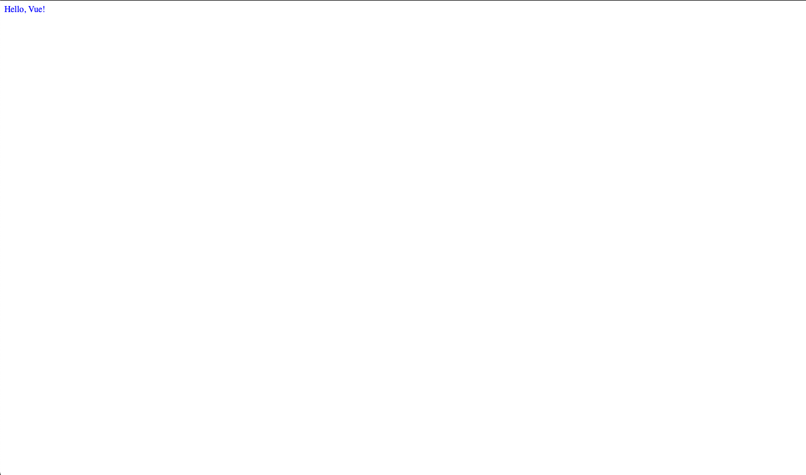

# vue-project

## Vue3 마이그레이션 완료! 

이 프로젝트는 Vue2에서 Vue3로 성공적으로 마이그레이션되었습니다. Composition API와 `<script setup>` 문법을 사용하도록 리팩터링했습니다.

---

## 🖼️ 프로젝트 미리보기

### 전체 화면



---

## 📋 변경 내역 요약

### 🔄 변환된 컴포넌트 (총 12개)

모든 컴포넌트를 **Options API**에서 **Composition API** (`<script setup lang="ts">`)로 리팩터링했습니다.

#### **Example 1: 기본 개념** (3개)
- `E-01-instance.vue` - `ref()`를 사용한 기본 데이터 바인딩
- `E-02-instance.vue` - computed 속성과 라이프사이클 훅
- `E-03-instance.vue` - `v-model`을 이용한 양방향 바인딩


#### **Example 2: 디렉티브** (1개)
- `E-04-directives.vue` - Vue 디렉티브 모음 (v-if, v-for, v-show, v-bind, v-on 등)


#### **Example 3: 컴포넌트 간 통신** (2개)
- `ChildComponent.vue` - TypeScript 타입을 사용한 Props와 Emits
- `ParentComponent.vue` - 부모-자식 컴포넌트 통신


#### **Example 4: Provide/Inject** (3개)
- `ChildComponent1.vue` - 공유 데이터 주입받기
- `ChildComponent2.vue` - 중첩된 inject
- `ParentComponent.vue` - 데이터 제공하기


#### **Example 5: API 비교** (3개)
- `E-07-Options-API.vue` - Options API를 Composition API로 변환
- `E-08-composition-api.vue` - `setup()` 함수를 `<script setup>`으로 변환
- `E-09-composition-API2.vue` - 이미 `<script setup>` 사용 중, TypeScript 타입 추가


#### **Example 6: 반응성 시스템** (3개)
- `E-10-ref.vue` - 원시 값에 `ref()` 사용
- `E-11-reactive.vue` - 객체에 `reactive()` 사용
- `E-12-ref-component.vue` - DOM 요소 참조를 위한 template refs


---

## 🔑 주요 변경사항

### **1. 스크립트 구조**

**변경 전 (Vue2 Options API):**
```vue
<script>
export default {
  data() {
    return { count: 0 }
  },
  methods: {
    increment() { this.count++ }
  }
}
</script>
```

**변경 후 (Vue3 Composition API):**
```vue
<script setup lang="ts">
import { ref } from 'vue';

const count = ref(0);
const increment = () => { count.value++ };
</script>
```

---

### **2. 반응형 데이터**

| 기능 | Vue2 | Vue3 |
|------|------|------|
| 데이터 | `data() { return {...} }` | `ref()` 또는 `reactive()` |
| 계산된 속성 | `computed: { ... }` | `computed(() => ...)` |
| 메서드 | `methods: { ... }` | `const funcName = () => {...}` |
| 감시자 | `watch: { ... }` | `watch(source, callback)` |

---

### **3. 라이프사이클 훅**

| Vue2 Options API | Vue3 Composition API |
|------------------|----------------------|
| `beforeCreate()` | `setup()` (내부에서 직접 실행) |
| `created()` | `setup()` (내부에서 직접 실행) |
| `beforeMount()` | `onBeforeMount()` |
| `mounted()` | `onMounted()` |
| `beforeUpdate()` | `onBeforeUpdate()` |
| `updated()` | `onUpdated()` |
| `beforeUnmount()` | `onBeforeUnmount()` |
| `unmounted()` | `onUnmounted()` |

---

### **4. Props & Emits**

**변경 전:**
```vue
<script>
export default {
  props: ['message'],
  methods: {
    sendEvent() {
      this.$emit('custom-event', payload)
    }
  }
}
</script>
```

**변경 후:**
```vue
<script setup lang="ts">
defineProps<{ message: string }>();

const emit = defineEmits<{
  'custom-event': [payload: string];
}>();

const sendEvent = () => {
  emit('custom-event', payload);
};
</script>
```

---

### **5. Provide/Inject**

**변경 전:**
```vue
<script>
export default {
  provide() {
    return { key: 'value' }
  },
  inject: ['key']
}
</script>
```

**변경 후:**
```vue
<script setup lang="ts">
import { provide, inject } from 'vue';

// 데이터 제공
provide('key', 'value');

// 데이터 주입
const key = inject<string>('key');
</script>
```

---

### **6. Template Refs**

**변경 전:**
```vue
<script>
export default {
  mounted() {
    this.$refs.inputField.focus();
  }
}
</script>
```

**변경 후:**
```vue
<script setup lang="ts">
import { ref, onMounted } from 'vue';

const inputField = ref<HTMLInputElement | null>(null);

onMounted(() => {
  inputField.value?.focus();
});
</script>

<template>
  <input ref="inputField" />
</template>
```

---

## ✅ 설정 파일 상태

모든 설정 파일이 Vue3와 호환됩니다:

- ✅ `main.ts` - `createApp()` 사용 (Vue3)
- ✅ `App.vue` - `defineComponent` 사용 (Vue3)
- ✅ `package.json` - Vue 3.2.13 설치됨
- ✅ `shims-vue.d.ts` - `DefineComponent` 타입 사용
- ✅ `tsconfig.json` - Vue3에 최적화

**추가 설정 변경 필요 없음!**

---

## 🚀 프로젝트 실행 방법

### 의존성 설치
```bash
npm install
```

### 개발 서버 실행 (핫 리로드 지원)
```bash
npm run serve
```

### 프로덕션 빌드
```bash
npm run build
```

### 린트 검사 및 수정
```bash
npm run lint
```

---
## 📚 참고 자료

- [Vue 3 공식 문서](https://vuejs.org/)
- [Composition API 가이드](https://vuejs.org/guide/extras/composition-api-faq.html)
- [Script Setup 문서](https://vuejs.org/api/sfc-script-setup.html)
- [Vue 3 마이그레이션 가이드](https://v3-migration.vuejs.org/)
- [TypeScript와 Vue 사용하기](https://vuejs.org/guide/typescript/overview.html)

---

## 🎯 Vue3 Composition API의 장점

1. **더 나은 TypeScript 지원** - 완벽한 타입 추론
2. **더 나은 코드 구성** - 관련 로직을 함께 그룹화 가능
3. **더 나은 코드 재사용** - Composable 함수 작성 가능
4. **작은 번들 사이즈** - Tree-shaking 지원
5. **향상된 성능** - 최적화된 반응성 시스템

---

### 추가 설정
자세한 내용은 [Configuration Reference](https://cli.vuejs.org/config/)를 참고하세요.