# vue-project

## 초급프로젝트 실습 2-2

Vue2에서 Vue3로 리펙터링하였습니다.
Composition API와 `<script setup>` 문법을 사용하도록 리팩터링했습니다.

---

## 프로젝트

> 💡 **실행 방법**: `npm run serve` 후 `http://localhost:8080` 접속

---

## 📋 변경 내역 요약

### 🔄 변환된 컴포넌트 (총 12개)

모든 컴포넌트를 **Options API**에서 **Composition API** (`<script setup lang="ts">`)로 리팩터링했습니다.

---

#### **Example 1: 기본 개념** (3개)

**컴포넌트 목록:**
- `E-01-instance.vue` - `ref()`를 사용한 기본 데이터 바인딩
- `E-02-instance.vue` - computed 속성과 라이프사이클 훅
- `E-03-instance.vue` - `v-model`을 이용한 양방향 바인딩

**동작 화면:**


*E01*

*E02*

*E03*

<details>
<summary>📌 주요 기능</summary>

- **E-01**: "Hello, Vue!" 메시지를 파란색으로 표시
- **E-02**: "Kyungsu Lee" 표시 후 2초 뒤 "KSL Lee"로 변경
- **E-03**: 입력 필드와 실시간 양방향 바인딩

</details>

---

#### **Example 2: 디렉티브** (1개)

**컴포넌트 목록:**
- `E-04-directives.vue` - Vue 디렉티브 모음 (v-if, v-for, v-show, v-bind, v-on 등)

**동작 화면:**

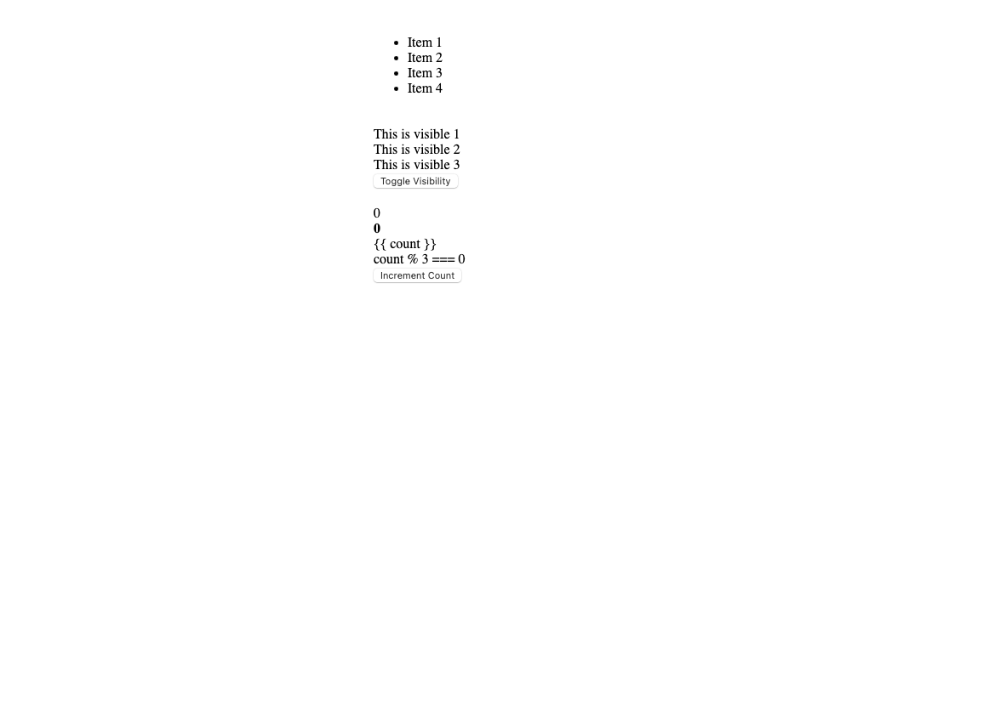
*초기 화면: 모든 요소가 표시된 상태*

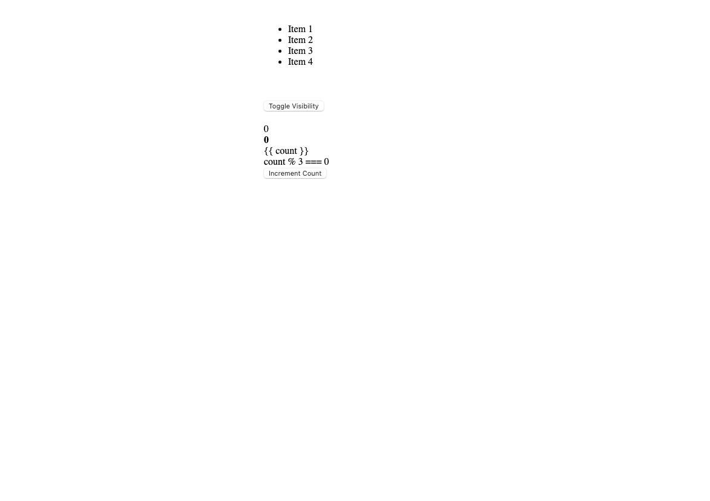
*토글 버튼 클릭 후: 일부 요소가 숨겨진 상태*

<details>
<summary>📌 주요 기능</summary>

- 4개 아이템 리스트 렌더링 (v-for)
- 가시성 토글 버튼 (v-if, v-show, :style)
- 카운트 증가 및 조건부 렌더링 (v-if, v-else-if, v-else)
- 다양한 디렉티브 테스트 (v-text, v-html, v-pre)

</details>

---

#### **Example 3: 컴포넌트 간 통신** (2개)

**컴포넌트 목록:**
- `ChildComponent.vue` - TypeScript 타입을 사용한 Props와 Emits
- `ParentComponent.vue` - 부모-자식 컴포넌트 통신

**동작 화면:**

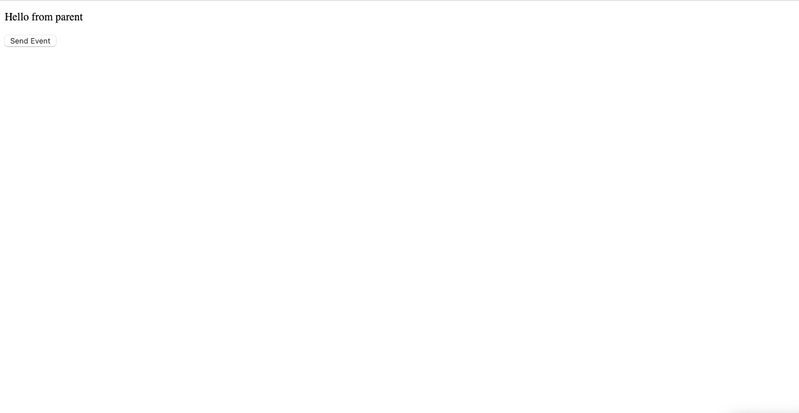

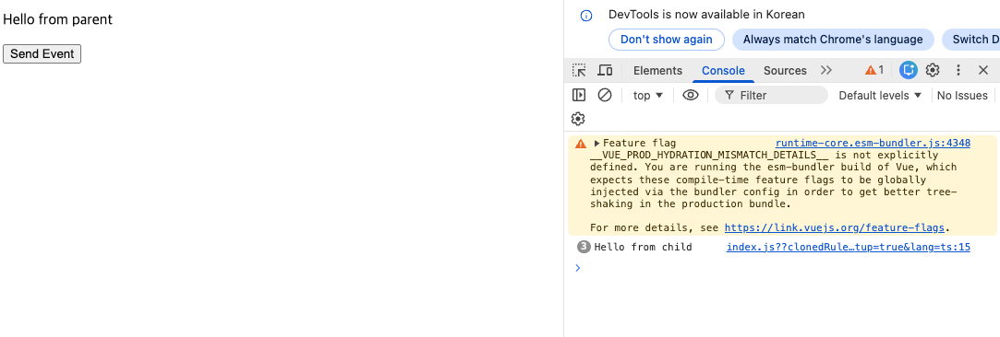
*버튼 클릭 시 콘솔에 "Hello from child" 출력*

<details>
<summary>📌 주요 기능</summary>

- **부모 → 자식**: "Hello from parent" 메시지 전달 (Props)
- **자식 → 부모**: 버튼 클릭 시 "Hello from child" 이벤트 발생 (Emit)
- 콘솔에서 이벤트 확인 가능

</details>

---

#### **Example 4: Provide/Inject** (3개)

**컴포넌트 목록:**
- `ParentComponent.vue` - 데이터 제공하기
- `ChildComponent1.vue` - 공유 데이터 주입받기
- `ChildComponent2.vue` - 중첩된 inject

**동작 화면:**

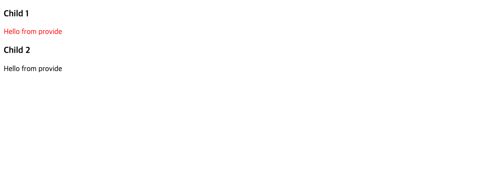

<details>
<summary>📌 주요 기능</summary>

- **ParentComponent**: "Hello from provide" 메시지 제공
- **ChildComponent1**: 메시지를 빨간색 텍스트로 표시
- **ChildComponent2**: 메시지를 큰 폰트(1.5rem)로 표시
- 여러 단계 중첩된 컴포넌트 간 데이터 공유

</details>

---

#### **Example 5: API 비교** (3개)

**컴포넌트 목록:**
- `E-07-Options-API.vue` - Options API를 Composition API로 변환
- `E-08-composition-api.vue` - `setup()` 함수를 `<script setup>`으로 변환
- `E-09-composition-API2.vue` - 이미 `<script setup>` 사용 중, TypeScript 타입 추가

**동작 화면:**

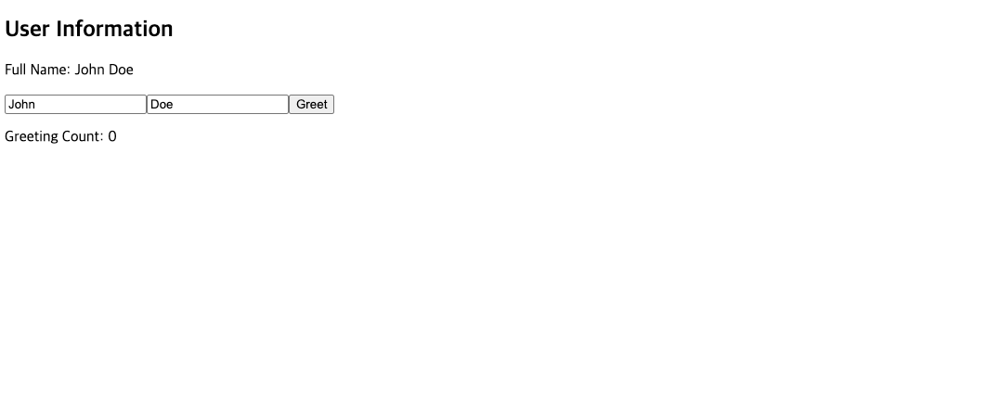
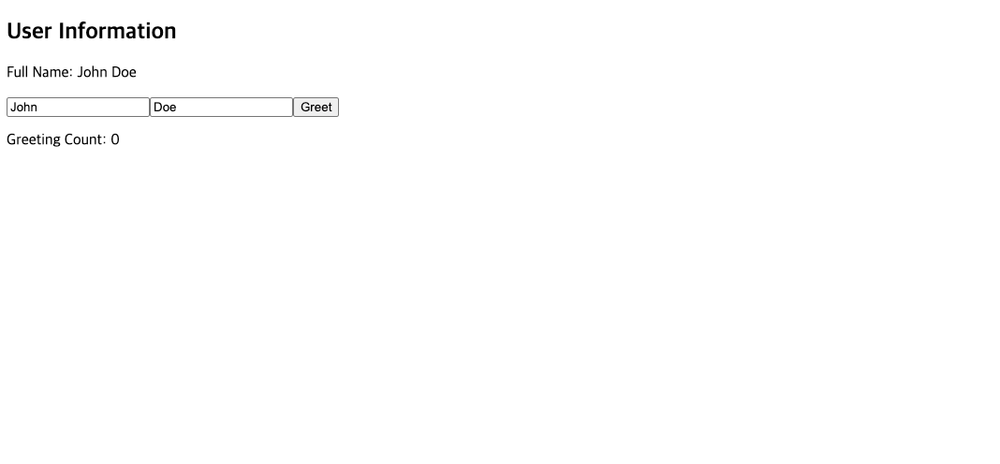
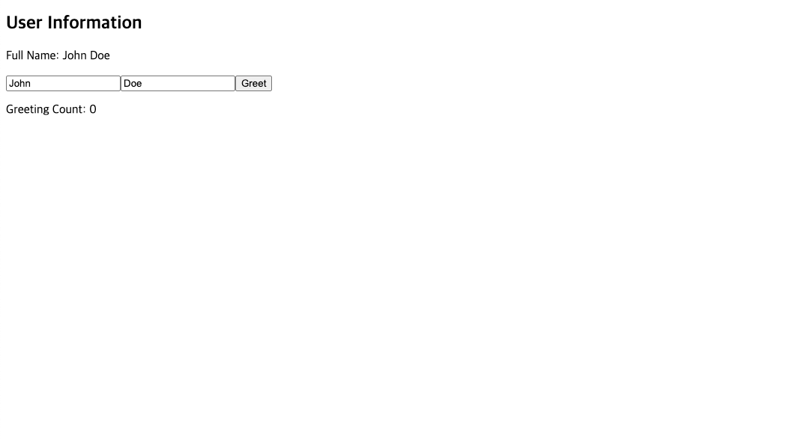
*초기 화면: 3개 컴포넌트 모두 동일한 "John Doe" 표시*

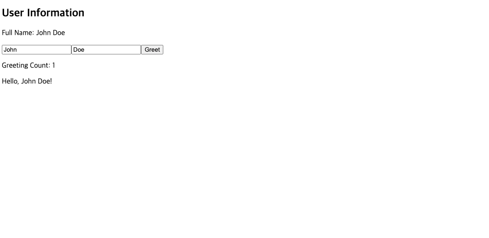
*Greet 버튼 1~2번 클릭 후 :"Hello, John Doe!" 메시지*
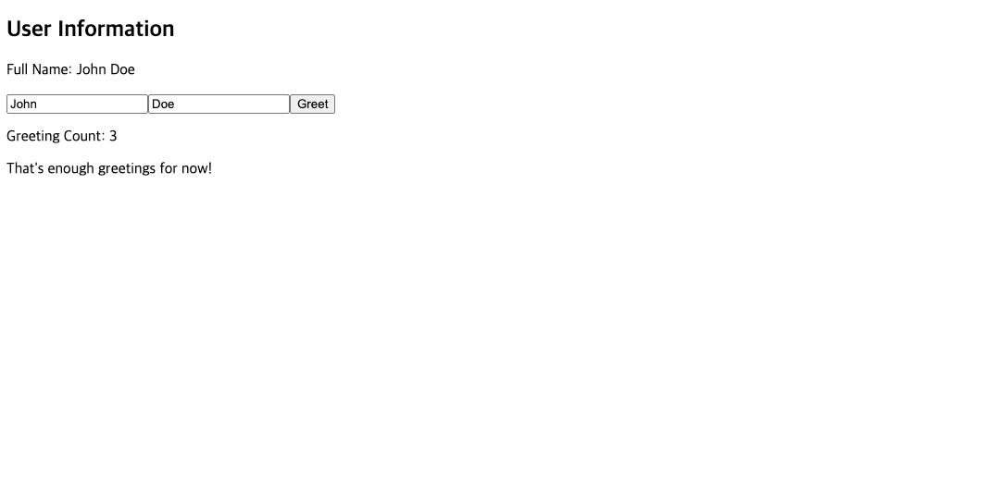
*Greet 버튼 3번 클릭 후: "That's enough greetings for now!" 메시지*

<details>
<summary>📌 주요 기능</summary>

- 이름 입력 필드 (firstName, lastName)
- Computed로 fullName 계산
- Greet 버튼으로 인사 횟수 증가
- Watch로 3회 이상 클릭 시 메시지 변경
- 모든 라이프사이클 훅 콘솔 출력
- **3개 컴포넌트 모두 동일한 기능, 다른 API 스타일**

</details>

---

#### **Example 6: 반응성 시스템** (3개)

**컴포넌트 목록:**
- `E-10-ref.vue` - 원시 값에 `ref()` 사용
- `E-11-reactive.vue` - 객체에 `reactive()` 사용
- `E-12-ref-component.vue` - DOM 요소 참조를 위한 template refs

**동작 화면:**


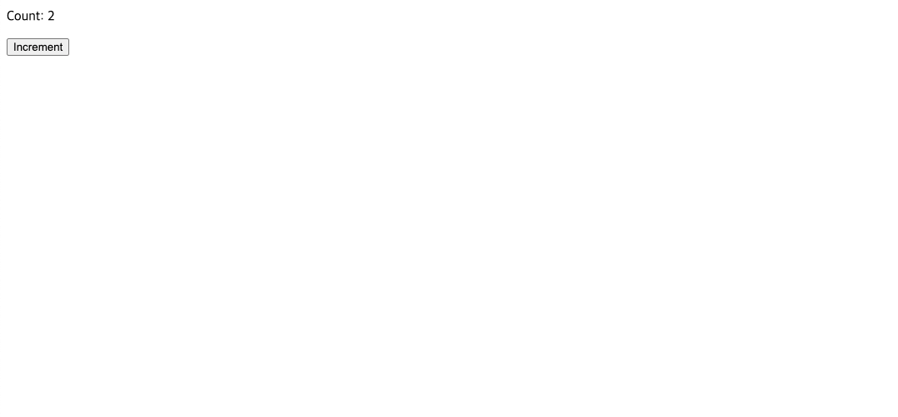
*E-10: Increment 버튼 2번 눌렀을 때의 모습*

*E-11* 
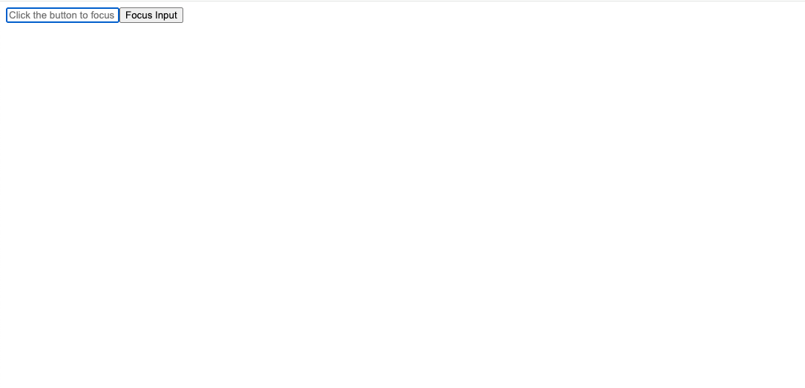
*E-12: 마운트 시 자동으로 input에 포커스, 버튼으로 재포커스 가능*

<details>
<summary>📌 주요 기능</summary>

- **E-10**: `ref()`로 count 관리 및 증가
- **E-11**: `reactive()`로 person 객체 관리 및 나이 증가
- **E-12**: Template ref로 DOM input 요소에 직접 접근하여 포커스

</details>

---

## 🔑 주요 변경사항

### **1. 스크립트 구조**

**변경 전 (Vue2 Options API):**
```vue
<script>
export default {
  data() {
    return { count: 0 }
  },
  methods: {
    increment() { this.count++ }
  }
}
</script>
```

**변경 후 (Vue3 Composition API):**
```vue
<script setup lang="ts">
import { ref } from 'vue';

const count = ref(0);
const increment = () => { count.value++ };
</script>
```

---

### **2. 반응형 데이터**

| 기능 | Vue2 | Vue3 |
|------|------|------|
| 데이터 | `data() { return {...} }` | `ref()` 또는 `reactive()` |
| 계산된 속성 | `computed: { ... }` | `computed(() => ...)` |
| 메서드 | `methods: { ... }` | `const funcName = () => {...}` |
| 감시자 | `watch: { ... }` | `watch(source, callback)` |

---

### **3. 라이프사이클 훅**

| Vue2 Options API | Vue3 Composition API |
|------------------|----------------------|
| `beforeCreate()` | `setup()` (내부에서 직접 실행) |
| `created()` | `setup()` (내부에서 직접 실행) |
| `beforeMount()` | `onBeforeMount()` |
| `mounted()` | `onMounted()` |
| `beforeUpdate()` | `onBeforeUpdate()` |
| `updated()` | `onUpdated()` |
| `beforeUnmount()` | `onBeforeUnmount()` |
| `unmounted()` | `onUnmounted()` |

---

### **4. Props & Emits**

**변경 전:**
```vue
<script>
export default {
  props: ['message'],
  methods: {
    sendEvent() {
      this.$emit('custom-event', payload)
    }
  }
}
</script>
```

**변경 후:**
```vue
<script setup lang="ts">
defineProps<{ message: string }>();

const emit = defineEmits<{
  'custom-event': [payload: string];
}>();

const sendEvent = () => {
  emit('custom-event', payload);
};
</script>
```

---

### **5. Provide/Inject**

**변경 전:**
```vue
<script>
export default {
  provide() {
    return { key: 'value' }
  },
  inject: ['key']
}
</script>
```

**변경 후:**
```vue
<script setup lang="ts">
import { provide, inject } from 'vue';

// 데이터 제공
provide('key', 'value');

// 데이터 주입
const key = inject<string>('key');
</script>
```

---

### **6. Template Refs**

**변경 전:**
```vue
<script>
export default {
  mounted() {
    this.$refs.inputField.focus();
  }
}
</script>
```

**변경 후:**
```vue
<script setup lang="ts">
import { ref, onMounted } from 'vue';

const inputField = ref<HTMLInputElement | null>(null);

onMounted(() => {
  inputField.value?.focus();
});
</script>

<template>
  <input ref="inputField" />
</template>
```

---

## ✅ 설정 파일 상태

모든 설정 파일이 Vue3와 호환됩니다:

- ✅ `main.ts` - `createApp()` 사용 (Vue3)
- ✅ `App.vue` - `defineComponent` 사용 (Vue3)
- ✅ `package.json` - Vue 3.2.13 설치됨
- ✅ `shims-vue.d.ts` - `DefineComponent` 타입 사용
- ✅ `tsconfig.json` - Vue3에 최적화

**추가 설정 변경 필요 없음!**

---

## 🚀 프로젝트 실행 방법

### 의존성 설치
```bash
npm install
```

### 개발 서버 실행 (핫 리로드 지원)
```bash
npm run serve
```

### 프로덕션 빌드
```bash
npm run build
```

### 린트 검사 및 수정
```bash
npm run lint
```

### 추가 설정
자세한 내용은 [Configuration Reference](https://cli.vuejs.org/config/)를 참고하세요.